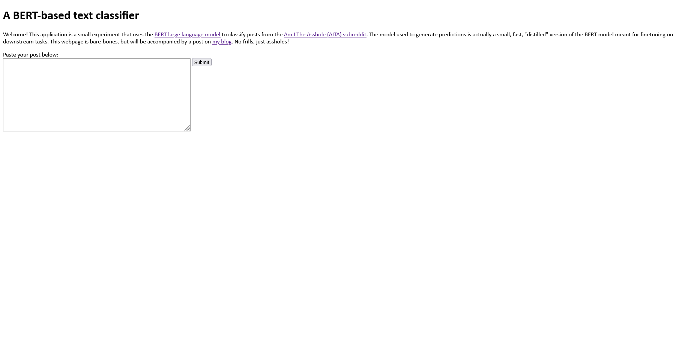

# A BERT-based text classifier!

## Table of Contents
1. [Overview](#overview)
2. [How to run this experiment on your machine](#run)
3. [Development process](#development)
4. [Lessons learned](#lessons)

## Overview 
Welcome! This application is a small experiment that uses the [BERT large language model](https://huggingface.co/distilbert-base-uncased) to classify posts from the [Am I The Asshole (AITA) subreddit](https://www.reddit.com/r/AmItheAsshole/). The model used to generate predictions is actually a small, fast, "distilled" version of the BERT model meant for finetuning ondownstream tasks. Please note, some of the files needed to be zipped to accomodate Git Large File Storage. The raw data [folder](data/raw) and [trained model](results/) are zip files. You can find the original project structure in my [OneDrive folder](https://1drv.ms/u/s!AkUOTbaWXaF8gbtE71qCMCRxTM3rvQ?e=RhnEYH) (view-only!). I've also posted this summary to my [personal blog](https://alliesaizan.github.io/).

My motivation for this project was to familiarize myself with the HuggingFace library. I've worked with LLMs in personal projects before, and wanted to experiment with the state-of-the-art LLM. I chose AITA data because:
- Okay, I love reading those stories. Sometimes, there's just no better way to spend time on the Internet than marveling at the extent of other peoples' audacity 😅
- The "Asshole/Not an Asshole" dichotomy was easy to translate into a text classification problem. There are other post categories, like "Everyone Sucks Here", that indicates the situation is more complex, but I don't include those posts in this analysis.

This repository is structured as follows:

- data
  - raw
    - big-query-aita-aug18-aug19.zip -- The results of a SQL query run against a database of reddit posts. The dataset covers all AITA posts from August 2018-2019. Unzip this file to use it. 
- results
  - checkpoint-20238.zip --The final PyTorch text classification model, saved at the last epoch runtime. Unzip this file to use it.
- src
  - transformers-model-train.py -- Python file used to train the model. Uses CUDA on GPU
- static
  - icon.png -- The AITA header icon 
  - style.css -- webpage formatting
- templates
  - home.html -- Homepage
  - results.html -- Webpage for prediction results 
- Dockerfile -- specifies container construction
- app.py -- a Flask application that enables the user to enter a AITA post and classifies whether the original poster (OP) is an asshole or not
- docer_compose.yaml -- Docker-compose file that specifies volume construction
- requirements_docker.txt -- Python libraries used to run the project

## How to run this experiment on your own machine 
Clone this repository to your local machine and open up the command prompt (Windows) or terminal (Mac, Linux). You will need to download the distilled BERT model to the working repository, as Docker-compose will include this folder as a volume. You can download the BERT model by running the command `git clone https://huggingface.co/distilbert-base-uncased`; note that it's about 2.4GB in size so download may take a while!

Ensure Docker is installed on your machine. For Windows, docker-compose will come bundled in the installation. Run `docker-compose up -d --build` as a command line operation. The Docker container will build and begin running. You can then navigate to port 5000 on your local machine to view the app!

## Development process 

I obtained the data I used to finetune the model from Google Cloud's BigQuery service. As mentioned above, the data consists of posts from the AITA subreddit with the flair "Asshole" or "Not the Asshole". I removed records where the body of the post was blank or deleted (I wonder how Reddit users assess these posts anyways!). The dataset consists of about ~72,000 posts after removing these records. I followed HuggingFace's [text classification tutorial](https://huggingface.co/docs/transformers/tasks/sequence_classification). Subsequent data preparation tasks include splitting the data into training and tests sets (I used a 75% split), tokenizing the text using the  `AutoTokenizer` with BERT as the base model, and transforming the training and test sets into a [Dataset object](https://huggingface.co/docs/datasets/v2.2.1/en/package_reference/main_classes#datasets.Dataset).

I then defined a Data Collator, which creates a bath of examples for the model to process in each step. The `DataCollatorWithPadding` class also ensures each text element in a batch is of uniform length. I defined the training hyperparameters to be used during the finetuning process, specifically:
- Learning rate: 2e-5
-Batch size for each device: 4
- Number of training epochs: 3
- Evaluate results at each epoch: true
- Save results at each epoch: true

Then it was model training time! Using a GPU, the model training process completed in about 2.5 hours. The training process outputted checkpoint models to the /results directory, and I used the model outputted in the last epoch as my final model. When model training was complete, I began to build the accompanying webapp. The home page, shown below, instructs the user to paste in the text body of an AITA post. When the user hits submit, the app will redirect to the "results" page, which will either output an prediction or will instruct the user to try a different post. Longer posts tend to generate more prediction errors; I didn't investigate this in the course of development but would revisit this issue in future iterations.

Finally, because just building the final model and app wasn't enough, I also wanted to take this opportunity to learn more about using Docker. I specified the configuration of the container in the Dockerfile and used the `docker-compose` command to set the BERT model up as a volume, build the container, and run it. 

## Lessons learned 
I learned quite a lot in the process of developing this application, including:
- How HuggingFace's API works
- How to successfully train a model on GPU
- How to deploy a model using a Flask app
- How to deploy that app as a container

The tutorial I used loaded data from HuggingFace's datasets module. If you want to use a custom dataset, you'll need to preprocess the data for the downstream transformers classes. Figuring out the correct data format took some trial and error. [This post on custom datasets](https://huggingface.co/transformers/v3.2.0/custom_datasets.html) was somewhat helpful, but I eventually figured out that the `Dataset` class needed records to be in a dictionary of the form {key: Torch tensor of text encodings at each index, labels: Torch tensor of the labels at each index}. Other text classification packages I've used, like gensim and NLTK, required more minimal data preprocessing, but the process of transforming the data manually did give me a little more insight into how the HuggingFace transformers infrastructure works.

I spent some time trying to figure out how to configure CUDA on my 64-bit Windows computer. I do not have much experience with deep learning models, and in the past I haven't really *needed* to use my GPU to train simpler (by comparison) clustering or ensemble models. I was able to figure out how to train models on my GPU after concluding that my initial PyTorch and transformers installations were incorrect. However, I ultimately found it more efficient to train the model on a GPU-enabled Google Colab notebook. Amelliorating my anxiety around running up my power bill + a shorter computing duration was certainly worth the small fee to use the notebook. Tip: GPU-enabled notebooks are available for free, but if you exceed predefined limits (by, for example, training complex deep neural networks on large datasets), you are temporarily prohibited from using GPUs to let other users run workloads.  

I wanted to ensure the app worked without transformers needing to use the Internet to fetch BERT each time the user runs the app. Volumes helped me figure out how to give my container access to the large BERT files through what's essentially a virtual hard drive. Volumes don't increase the size of the containers using them, so they're a great option for making large datasets available to apps that should otherwise be lightweight.  

Thank you for reading! 🎉
